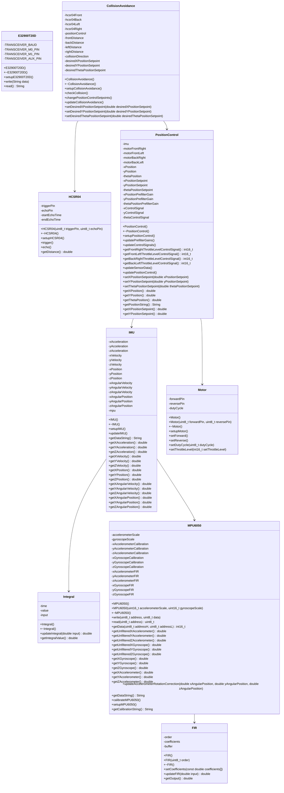

```mermaid
classDiagram
    class E32900T20D {
        +E32900T20D()
        +~E32900T20D()
        +setupE32900T20D()
        +write(String data)
        +read() String
        -TRANSCEIVER_BAUD
        -TRANSCEIVER_M0_PIN
        -TRANSCEIVER_M1_PIN
        -TRANSCEIVER_AUX_PIN
    }
    class FIR {
        +FIR()
        +FIR(uint8_t order)
        +~FIR()
        +setCoefficients(const double coefficients[])
        +updateFIR(double input) double
        +getOutput() double
        -order
        -coefficients
        -buffer
    }
    class HCSR04 {
        +HCSR04(uint8_t triggerPin, uint8_t echoPin)
        +~HCSR04()
        +setupHCSR04()
        +trigger()
        +echo()
        +getDistance() double
        -triggerPin
        -echoPin
        -startEchoTime
        -endEchoTime
    }
    class IMU {
        +IMU()
        +~IMU()
        +setupIMU()
        +updateIMU()
        +getDataString() String
        +getXAcceleration() double
        +getYAcceleration() double
        +getZAcceleration() double
        +getXVelocity() double
        +getYVelocity() double
        +getZVelocity() double
        +getXPosition() double
        +getYPosition() double
        +getZPosition() double
        +getXAngularVelocity() double
        +getYAngularVelocity() double
        +getZAngularVelocity() double
        +getXAngularPosition() double
        +getYAngularPosition() double
        +getZAngularPosition() double
        -xAcceleration
        -yAcceleration
        -zAcceleration
        -xVelocity
        -yVelocity
        -zVelocity
        -xPosition
        -yPosition
        -zPosition
        -xAngularVelocity
        -yAngularVelocity
        -zAngularVelocity
        -xAngularPosition
        -yAngularPosition
        -zAngularPosition
        -mpu
    }
    class Integral {
        +Integral()
        +~Integral()
        +updateIntegral(double input) double
        +getIntegralValue() double
        -time
        -value
        -input
    }
    class Motor {
        +Motor()
        +Motor(uint8_t forwardPin, uint8_t reversePin)
        +~Motor()
        +setupMotor()
        +setForward()
        +setReverse()
        +setDutyCycle(uint8_t dutyCycle)
        +setThrottleLevel(int16_t setThrottleLevel)
        -forwardPin
        -reversePin
        -dutyCycle
    }
    class MPU6050 {
        +MPU6050()
        +MPU6050(uint16_t accelerometerScale, uint16_t gyroscopeScale)
        +~MPU6050()
        +write(uint8_t address, uint8_t data)
        +read(uint8_t address) uint8_t
        +getData(uint8_t addressH, uint8_t addressL) int16_t
        +getUnfilteredXAccelerometer() double
        +getUnfilteredYAccelerometer() double
        +getUnfilteredZAccelerometer() double
        +getUnfilteredXGyroscope() double
        +getUnfilteredYGyroscope() double
        +getUnfilteredZGyroscope() double
        +getXGyroscope() double
        +getYGyroscope() double
        +getZGyroscope() double
        +getXAccelerometer() double
        +getYAccelerometer() double
        +getZAccelerometer() double
        +updateAccelerometerRotationCorrection(double xAngularPosition, double yAngularPosition, double zAngularPosition)
        +getDataString() String
        +calibrateMPU6050()
        +setupMPU6050()
        +getCalibrationString() String
        -accelerometerScale
        -gyroscopeScale
        -xAccelerometerCalibration
        -yAccelerometerCalibration
        -zAccelerometerCalibration
        -xGyroscopeCalibration
        -yGyroscopeCalibration
        -zGyroscopeCalibration
        -xAccelerometerFIR
        -yAccelerometerFIR
        -zAccelerometerFIR
        -xGyroscopeFIR
        -yGyroscopeFIR
        -zGyroscopeFIR
    }
    class PositionControl {
        +PositionControl()
        +~PositionControl()
        +setupPositionControl()
        +updatePrefilterGains()
        +updateControlSignals()
        +getFrontRightThrottleLevelControlSignal() int16_t
        +getFrontLeftThrottleLevelControlSignal() int16_t
        +getBackRightThrottleLevelControlSignal() int16_t
        +getBackLeftThrottleLevelControlSignal() int16_t
        +updateSensorData()
        +updatePositionControl()
        +setXPositionSetpoint(double xPositionSetpoint)
        +setYPositionSetpoint(double yPositionSetpoint)
        +setThetaPositionSetpoint(double thetaPositionSetpoint)
        +getXPosition() double
        +getYPosition() double
        +getThetaPosition() double
        +getPositionString() String
        +getXPositionSetpoint() double
        +getYPositionSetpoint() double
        -imu
        -motorFrontRight
        -motorFrontLeft
        -motorBackRight
        -motorBackLeft
        -xPosition
        -yPosition
        -thetaPosition
        -xPositionSetpoint
        -yPositionSetpoint
        -thetaPositionSetpoint
        -xPositionPrefilterGain
        -yPositionPrefilterGain
        -thetaPositionPrefilterGain
        -xControlSignal
        -yControlSignal
        -thetaControlSignal
    }
    class CollisionAvoidance {
        +CollisionAvoidance()
        +~CollisionAvoidance()
        +setupCollisionAvoidance()
        +checkCollision()
        +changePositionControlSetpoints()
        +updateCollisionAvoidance()
        +setDesiredXPositionSetpoint(double desiredXPositionSetpoint)
        +setDesiredYPositionSetpoint(double desiredYPositionSetpoint)
        +setDesiredThetaPositionSetpoint(double desiredThetaPositionSetpoint)
        -hcsr04Front
        -hcsr04Back
        -hcsr04Left
        -hcsr04Right
        -positionControl
        -frontDistance
        -backDistance
        -leftDistance
        -rightDistance
        -collisionDirection
        -desiredXPositionSetpoint
        -desiredYPositionSetpoint
        -desiredThetaPositionSetpoint
    }
    CollisionAvoidance --> HCSR04
    CollisionAvoidance --> PositionControl
    IMU --> MPU6050
    IMU --> Integral
    MPU6050 --> FIR
    PositionControl --> Motor
    PositionControl --> IMU
```